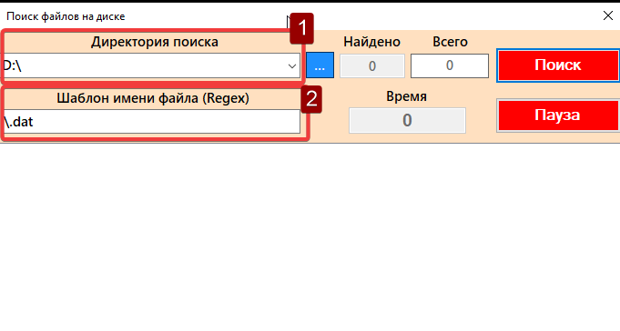

  
  

    
  

# Проводник
>
Проводник для Windows
>

## 🌐 **Что внутри?** 🌐

> Критерии:
1. Стартовая директория (с которой начинается поиск)
2. Шаблон имени файла в виде regex выражения

    

> Что отображает в режиме реального времени:

➡️1. Все найденные по критериям файлы
в виде дерева (как в левой части проводника).
Дерево не должно подвисать, моргать, тормозить и т.д.
Во время поиска пользователь может ходить по дереву, открывать/закрывать.

➡️2.   Название директории, в которой идет текущий поиск

➡️3.   Количество найденных и общее количество файлов. (Примечательно что поиск всех файлов в той или иной директории может затянуться в связи с чем число файлов появляется позднее чем заканчивается основной поиск файлов)

➡️4.   Прошедшее от начала запуска поиска время

    

> Особенности:

◀️1. Пользователь имеет возможность остановить поиск в любой момент и затем
либо продолжить его либо начать новый поиск.

---
В дополнение к пунктам выше ◀️ При нажатии на синюю строку с числом ошибок которые были обнаружены - откроется форма которая выведет их список. 

### <g-emoji class="g-emoji" alias="scroll" fallback-src="https://github.githubassets.com/images/icons/emoji/unicode/1f4dc.png">📜</g-emoji> Установка
---

📏 Visual Studio 2022 Professional
-
📏 .NET 6.0
-